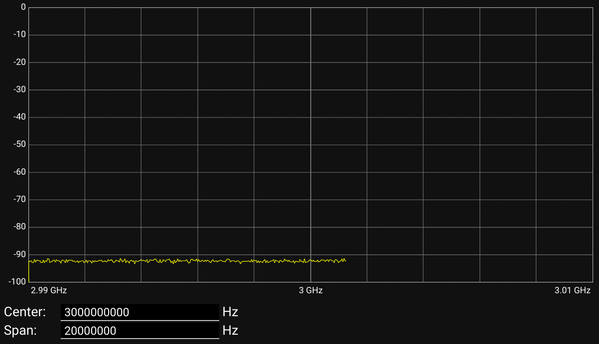
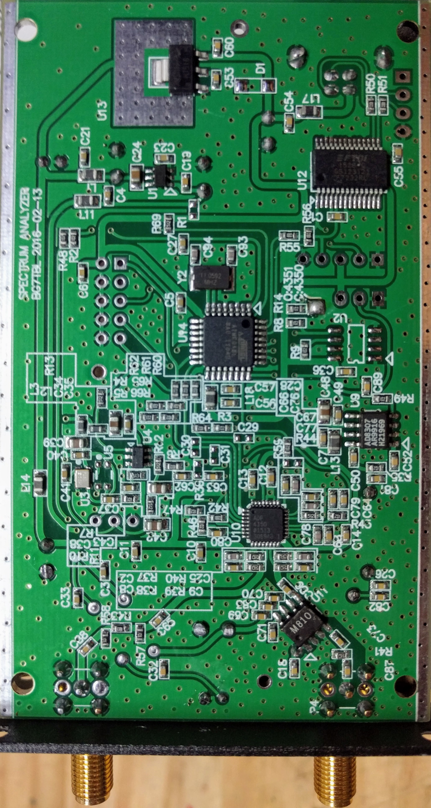

# BG7TBL-RF-USB

Spectrum Analyzer UI



138MHz-4.4GHz USB RF Source Signal Generator / Simple Spectrum Analyzer




## setup

To see the groups: `groups`

To see all available groups types: `compgen -g`

Have to add user into `tty` and `dialout` groups
```
sudo usermod -a -G tty yourname
sudo usermod -a -G dialout yourname
```

## References

  * https://sigrok.org/wiki/BG7TBL
  * https://github.com/darkstar007/NetworkAnalyser
